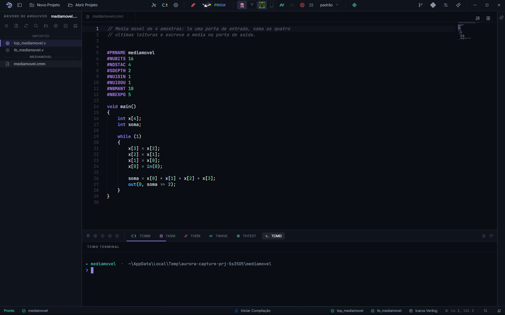

<p align="center">
  
</p>

<h1 align="center">AURORA IDE</h1>

<p align="center">
  <em>The integrated development environment for the SAPHO platform.</em>
</p>

<p align="center">
  <a href="https://github.com/nipscernlab/sapho/releases/latest"></a>
  <a href="https://github.com/nipscernlab/aurora/actions"></a>
  <a href="LICENSE"></a>
</p>

AURORA is a desktop IDE that covers the whole SAPHO hardware-design workflow
behind one interface: writing C±, assembling, synthesising Verilog, simulating,
reading waveforms, and inspecting RTL. It is built on Electron and Monaco, and it
runs on Windows only, because the toolchain it drives is Windows-only.

It is developed by [NIPS-CERN](https://www.nipscern.com), a research group at the
[Universidade Federal de Juiz de Fora](https://www.ufjf.br) in Brazil, working in
collaboration with CERN. The project page is
[nipscern.com/projects/aurora](https://www.nipscern.com/projects/aurora).

<p align="center">
  
</p>

The screenshot is taken from the running application by
[scripts/capture-media.js](scripts/capture-media.js), so it can be retaken
whenever the interface changes. Demo recordings are still pending.

## What it does

The editor is Monaco, split into up to three panes. Panes share the underlying
model, so an edit in one pane appears live in every other pane showing the same
file.

The compile buttons are deliberately self-contained. You never have to remember
to compile before opening waveforms or the RTL viewer, because each button
expands to the full sequence it needs and re-runs whatever is missing. Verilog
runs C± and assembly and then Icarus Verilog over the top level. Wave adds the
simulation and opens the viewer. PRISM adds Yosys. In a pure Verilog project the
C± and assembly steps disappear on their own, without any conditional in the
pipeline, because they iterate over a processor list that is simply empty.

Two independent choices sit behind the Wave button. You pick which simulator
runs, Icarus Verilog by default or Verilator, which transpiles to C++ and is
typically ten to a hundred times faster on long testbenches. And you pick which
viewer opens, the bundled GTKWave or Surfer. Both settings are global and
remembered.

Before simulating, a hierarchical picker walks the project's Verilog and lets you
choose which signals get dumped. That choice is stored per testbench, so it
survives across sessions. Without a saved choice, every signal at the testbench
scope is dumped, which matches what a plain `$dumpvars` would have given you.

PRISM is the RTL viewer. It synthesises with Yosys and draws the schematic with
netlistsvg, using per-module skins kept in the repository. It also has an
interactive simulation mode built on DigitalJS.

Aurora Intelligence is the assistant panel. It talks to models through two
different paths: directly by API, for provider keys you supply, and through the
Claude Code and Codex command-line tools, for people who already pay for those
subscriptions. Either way the model gets the same 106 IDE actions, because a
local MCP server hands the subscription CLIs the same tool surface the API path
gets. Without it those CLIs would fall back to shelling out to the compilers by
hand.

The rest of the surface is the ordinary IDE furniture, all of it wired to the
same project: a file tree with a filesystem view and a post-synthesis hierarchy
view, terminals including an interactive PowerShell, a git panel, language
servers for Verilog and SystemVerilog, formatting through clang-format, a Python
library manager for cocotb testbenches, and the SAPHO manual available offline.

## Installing

Most people should not build from source. Stable installers ship from the SAPHO
distribution repository, which is the release channel for the suite as a whole.
Download `sapho-aurora-Setup-vX.Y.Z.exe` from the
[SAPHO releases page](https://github.com/nipscernlab/sapho/releases/latest) and
run it.

The two repositories are separate on purpose. `nipscernlab/aurora` is where the
GUI is developed, and `nipscernlab/sapho` is what end users download.
[CONTRIBUTING.md](CONTRIBUTING.md) explains the split.

## Building from source

You need Windows 10 or 11. Everything else the setup script installs for you.

Clone the repository and run `setup.bat`. It can also be double-clicked from
Explorer, and it runs fine inside the VS Code integrated terminal:

```powershell
git clone https://github.com/nipscernlab/aurora.git
cd aurora
.\setup.bat
```

### Where the clone must not live

The first thing `setup.bat` does is refuse to run from the wrong place, because
every problem in this list shows up long after the install, disguised as
something else.

**Cloud-synced folders are the important one.** OneDrive, Dropbox, Google Drive,
iCloud Drive and Creative Cloud all break this project in three separate ways.
With Files On-Demand, toolchain binaries and `node_modules` entries turn into
cloud placeholders and fail to execute. The synchroniser holds files open, so
extracting the toolchain fails part-way and leaves the install half-finished.
And it rewrites files while the application is working, which AURORA sees as
project changes and answers by re-reading git status and repainting the tree,
over and over, for edits nobody made. Move the clone somewhere local, such as
`C:\Dev\aurora`. The script stops with that instruction rather than letting you
find out later.

**Network shares (UNC paths) do not work either.** The bootstrap links
`components/` into the Electron distribution with a directory junction, and
junctions do not exist on a network share.

**Removable drives formatted FAT32 or exFAT** fail for the same reason: no
junctions.

Two more the script warns about instead of blocking. A **very long path** leaves
too little headroom under Windows' 260-character limit once `node_modules`
nesting is added. And an **`&` anywhere in the path** breaks any script that
does not quote it, which is why the packaging identity avoids it too.

Finally, one that no script can detect: **antivirus software quarantining
`components/`**. The toolchain is a few hundred megabytes of freshly extracted
executables, which is exactly the shape real-time scanners act on. AURORA already
watches for this and can repair itself, but if the bootstrap keeps failing on
files that were there a moment ago, add an exclusion for the `components/`
directory.

The script checks and installs, in order: Git, Node.js LTS, and (after asking)
VS Code, all through `winget`, which ships with Windows 10 and 11. It then runs
`npm install` and the toolchain bootstrap, and offers to start the app. Every
step detects what is already in place and skips it, so running it again is
always safe, and it stops with a clear message on the first real failure.

If you would rather do it by hand, the requirements are Git and Node.js 22.22.1
or newer. That floor is not arbitrary: `lint-staged` sets it, and Electron,
commitlint and the Claude Code CLI each demand something close behind. Older
versions may appear to work and will emit engine warnings during install.

```powershell
winget install --id OpenJS.NodeJS.LTS -e --source winget
winget install --id Git.Git           -e --source winget
```

Reopen PowerShell so the new executables are on your `PATH`, then:

```powershell
npm install
npm start
```

The first `npm start` does considerably more than launch Electron. Its `prestart`
hook runs `npm run bootstrap`, which is thirteen steps: it synchronises the CLI
download manifest, verifies that exact-pinned dependencies match what is
installed, downloads ten separate components, and finally links `components/`
into the Electron distribution so the running app can reach the toolchain.

What gets downloaded, each with a sentinel so it is skipped when already present:
the MSYS toolchain bundle with Icarus Verilog, Yosys and cocotb; the YANC
compilers; the NIPS-CERN build of GTKWave; Surfer; the
Verible language server; clang-format; the Slang language server; the tree-sitter
grammars; and the SAPHO manual. Any of them can be re-fetched with `--force`, for
example:

```powershell
node components/Scripts/download-toolchain.js --force
```

If a download fails behind a corporate proxy, the script prints the URL it tried,
so you can fetch the archive in a browser and extract it by hand.

### Working in VS Code

The repository carries its shared editor configuration in [.vscode/](.vscode/),
so a fresh clone opens ready to work. `F5` runs the app (either plain or with
renderer hot-reload), and the Command Palette's *Run Task* lists the setup, the
two run modes, the tests and the component doctor. The settings file also keeps
the downloaded toolchain out of VS Code's search index and file watcher, which
otherwise spends memory and CPU tracking about a gigabyte of binaries.

To produce an installer, `npm run build` runs the bootstrap again and then
electron-builder, leaving the NSIS installer, its blockmap, and the updater
manifest under `dist/`.

## Keeping the language rules in sync

The assistant panel and the editor's introspection read a static
[`resources/sapho_rules.json`](resources/sapho_rules.json) that captures the C±
language surface: keywords, hardware directives, the bilingual error catalogue,
and a grammar skeleton. It is extracted from the
[yanc](https://github.com/nipscernlab/yanc) source tree, which is not bundled
with the installer, so the file has to be regenerated on a maintainer machine
whenever yanc changes.

```powershell
$env:YANC_PATH = 'D:\path\to\yanc'
npm run rules:sync
```

The script prints keyword, directive and message counts along with the yanc
commit it read. Commit the regenerated JSON so CI never has to reach yanc
directly.

## Releasing

Every push to `main` keeps a release pull request open, aggregating the
conventional commits since the last release and preparing the version bump and
changelog. Merging that pull request creates the tag and the GitHub release.
Building and publishing the installer is a separate, manually triggered workflow,
so cutting a version and shipping a binary stay independent.

Releases go to `nipscernlab/sapho`, not to this repository. The updater reads the
same place, so the two never disagree.

The toolchain bundle lives in its own pre-release rather than in the source tree,
and only needs a new one when the bundled binaries actually change.

## How updating works

Roughly six seconds after the main window appears, a packaged AURORA checks the
SAPHO releases quietly. Nothing interrupts you when there is nothing to install.

When there is an update, AURORA opens its own window showing the bilingual
changelog, never a native dialog. You choose when to download, a real progress
bar tracks it, and the download is incremental, so a small fix does not re-fetch
the whole installer. The update installs when you close the application, without
an elevation prompt, and the next launch comes up on the new version.

The check is scheduled with retries rather than fired once, because a machine six
seconds into boot may still be behind a captive portal or a proxy that is not
ready yet.

## Logs

Attaching `main.log` to a bug report makes diagnosis much easier.

| OS      | Path                            |
|---------|---------------------------------|
| Windows | `%APPDATA%\SAPHO\logs\main.log` |
| macOS   | `~/Library/Logs/SAPHO/main.log` |
| Linux   | `~/.config/SAPHO/logs/main.log` |

The directory name comes from `app.getName()`, which resolves to the `productName`
in `package.json` and not to the one under `build`, which only names the installer
and the install directory. Getting that wrong sent bug reporters to an empty
folder for a while.

The reliable route is Settings, then About, then Updates, then Open log, which
always reveals the real file. The log rolls over around 5 MB and defaults to the
`info` level; [`main/logger.js`](main/logger.js) is where you raise it.

## Documentation

[ARCHITECTURE.md](ARCHITECTURE.md) covers the state contracts the renderer
depends on but does not enforce, each one learned from something breaking
subtly. [TODO.md](TODO.md) is the single implementation guide and the honest
backlog of what has not been done yet.

## Contributing, security, licence

Bug reports, feature requests and pull requests are welcome. Read
[CONTRIBUTING.md](CONTRIBUTING.md) first, and
[CODE_OF_CONDUCT.md](CODE_OF_CONDUCT.md) for community standards.

Security issues should not be opened as public issues. Follow the disclosure
process in [SECURITY.md](SECURITY.md).

AURORA is released under the [NIPS-CERN Licence 1.1](LICENSE), the laboratory's
base licence plus a product annex. Reading, using, modifying and redistributing
are free; commercial exploitation, meaning selling the work itself or charging
for it, needs prior written authorisation. Using AURORA as a tool inside
commercial activity is not commercial exploitation. The bundled third-party
toolchain keeps its own licences, listed in
[THIRD_PARTY_NOTICES.md](THIRD_PARTY_NOTICES.md).

## About NIPS-CERN

AURORA is developed and maintained by NIPS-CERN, the research and development
group of the Department of Electrical Engineering at the
[Universidade Federal de Juiz de Fora](https://www.ufjf.br), Brazil.

The group operates two laboratories, with students and researchers working at
both. The department is a
[member institution of the ATLAS Collaboration](https://atlaspo.cern.ch/public/institutions/),
with system membership in the Tile Calorimeter and the Liquid-Argon Calorimeter.

| | |
|---|---|
| **NIPS**, UFJF | Depto. de Engenharia Elétrica, PPEE<br>R. José Lourenço Kelmer, s/n<br>Juiz de Fora, MG 36036-900, Brasil |
| **Route Salam**, CERN | Espl. des Particules 1<br>CH-1211 Genève 23, Suisse |

| | |
|---|---|
| Institutional website | [nipscern.com](https://www.nipscern.com) |
| About the group | [nipscern.com/about](https://www.nipscern.com/about) |
| SAPHO project page | [nipscern.com/projects/sapho](https://www.nipscern.com/projects/sapho) |
| AURORA project page | [nipscern.com/projects/aurora](https://www.nipscern.com/projects/aurora) |
| Publications | [nipscern.com/publications](https://www.nipscern.com/publications) |
| Contact | contact@nipscern.com |

### Citing SAPHO

The architecture is described in:

> SAPHO, Scalable-Architecture Processor for Hardware Optimization: An FPGA
> Customizable Implementation Approach. *IEEE*, 2026.
> <https://ieeexplore.ieee.org/document/11345120/>

Further publications on SAPHO, AURORA and YANC, including applications in
high-energy physics instrumentation, are listed at
[nipscern.com/publications](https://www.nipscern.com/publications).

## Acknowledgements

AURORA builds on work from the open-source EDA community, in particular Icarus
Verilog, GTKWave, Yosys, netlistsvg, Surfer, Verible, Slang, cocotb, Monaco and
Electron.
